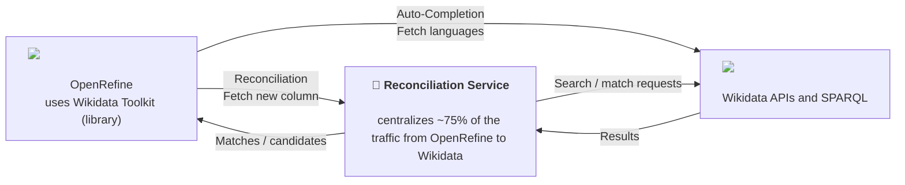

Since 2018, Wikidata has been the default reconciliation service packaged with OpenRefine and plays a critical role in many workflows. According to our [2024 user survey](https://openrefine.org/blog/2024/12/20/2024-survey-results), a significant portion of users rely on it (25% identify as Wikimedians, and 44% use the Wikidata reconciliation service).

Over the past weeks, users have reported intermittent issues when reconciling data against Wikidata, including errors and incomplete results. These reports surfaced across our forum and issue trackers [here](https://forum.openrefine.org/t/error-while-reconciliating/2747), [here](https://forum.openrefine.org/t/add-columns-from-reconciled-values-not-working-via-wikidata/2746), [here](https://forum.openrefine.org/t/error-in-reconciling-to-wikidata/2387/) and on [#7741](https://github.com/OpenRefine/OpenRefine/issues/7741).

In parallel, the Wikimedia engineering team opened [#7731](https://github.com/OpenRefine/OpenRefine/issues/7731) to communicate upcoming changes in API rate limiting.

Recent changes at the service and infrastructure level have addressed the immediate outage, and the situation should be returning to normal. However, the incident highlighted deeper structural issues, and further improvements are needed to ensure compliance with evolving Wikidata and Wikimedia rate limits.

For now, we encourage users to continue reporting issues. The OpenRefine forum remains a practical place to surface problems until clearer support channels exist for the reconciliation service.

This post aims to clarify the structure and ownership of the Wikidata reconciliation ecosystem, and outline paths toward a more reliable setup.
<!--truncate-->

## **A complex structure**

The reconciliation workflow involves multiple layers. OpenRefine is the user-facing interface, but several parts of the system are owned and operated independently.

The main components are:

* **OpenRefine**, the main user interface used to interact with Wikidata and reconciliation services
* **Wikidata Toolkit**, a separate library used by OpenRefine to interact directly with Wikidata APIs for some operations
* **The reconciliation service**, which centralizes around 75% of the traffic from OpenRefine to Wikidata
* **Wikidata APIs and SPARQL endpoint**

They interact as follows:

## **What surfaced during this outage**

Investigating the issue (see [T419770](https://phabricator.wikimedia.org/T419770)) highlighted several structural challenges related to the reconciliation service:

* It depends on Wikidata APIs, whose behavior and limits evolve over time
* It operates as shared infrastructure handling bursty demand from multiple users
* Its ownership and maintenance responsibilities are unclear
* It lacks clear observability (like a status page) and support channels (with the OpenRefine forum often acting as a fallback)

This incident made visible something important: OpenRefine is often perceived as the owner of the Wikidata reconciliation service because issues are reported through it — but it is not.

## **Scope clarification**

OpenRefine is a **client of the reconciliation protocol**. Wikidata is one of many reconciliation services (30+ identified in the 2024 survey) that can be used with OpenRefine.

OpenRefine provides:

* The user interface
* Data transformation tools
* The ability to connect to reconciliation services

The Wikidata reconciliation service is:

* A separate service, specific to the Wikimedia ecosystem
* Operated independently from OpenRefine
* Dependent on Wikimedia infrastructure and policies

While OpenRefine integrates this service by default, it does not own or operate it.

This distinction matters:

* Many OpenRefine users do not use Wikidata
* Each reconciliation service is tied to its data provider
* Running a production service requires infrastructure, monitoring, and ongoing maintenance, something a desktop application like OpenRefine is not designed to provide
* Configuring a reconciliation service requires domain knowledge of the underlying data (search, ranking, scoring), which sits with the data provider

This is why reconciliation services are typically operated by data providers, institutions, or third parties and not by tools like OpenRefine.

## **Supporting the Wikidata reconciliation service**

With that being said, we recognize the importance of the Wikidata reconciliation service as a key part of the OpenRefine ecosystem. Many OpenRefine contributors are also active in the Wikimedia ecosystem and contribute across projects. We are encouraged to see individuals and organizations stepping up.

At the moment, the situation is still evolving, and discussions are ongoing around governance, maintenance, and hosting.

We are eager to see a more formal and sustainable setup emerge, including:

* A clearly identified repository and contribution workflow
* Active maintainers reviewing and merging contributions
* A group or organization taking responsibility for hosting (which can differ from the group maintaining the codebase). 

The OpenRefine project, as a major client of the service, is happy to support and participate in these discussions, but will not take ownership of the service.

## **What we are doing at OpenRefine level**

Within its scope, the OpenRefine project is taking steps to improve the situation:

* Improving User-Agent management for requests made by OpenRefine itself (see [#7731](https://github.com/OpenRefine/OpenRefine/issues/7731))
* Improving error handling so users can better understand where issues originate (see [#7699](https://github.com/OpenRefine/OpenRefine/issues/7699))
* Supporting efforts to improve governance and sustainability of the reconciliation service

## **Conclusion**

This incident highlighted both the importance of the Wikidata reconciliation service and the need for clearer ownership and coordination. The current momentum and community engagement are encouraging, and we look forward to working with the broader ecosystem toward a more robust and sustainable setup. Clarifying these roles is a key step toward a more reliable reconciliation system.

