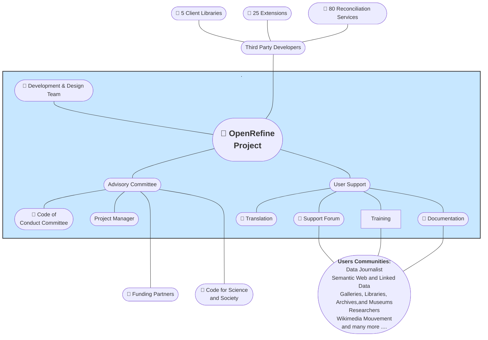

# OpenRefine Ecosystem

The OpenRefine ecosystem is composed of multiple communities and use cases. The core team is responsible for maintaining OpenRefine, its documentation, and discussion forums. The Advisory Committee is responsible for OpenRefine funding and adminstrative task. 

On the other hand, OpenRefine's user communities adapt the software to meet their specific needs. These communities are actively engaged in advocacy, training, and support activities. For example, libraries host training sessions for archivists, librarians, and researchers, workshops are organized at data journalist conferences, and dedicated training sessions are tailored for Wikimedians.

Third-party developers can also create new extensions and reconciliation services compatible with OpenRefine. Reconciliation services allow users to link their datasets with a knowledge graph, while extensions add domain-specific features or integrate OpenRefine into a particular workflow. These services expand the capabilities of OpenRefine, enabling users to accomplish their data-related tasks more efficiently.

### Overview of OpenRefine ecosystem 

