# OpenRefine Ecosystem

The OpenRefine ecosystem comprises the OpenRefine project, which maintains the OpenRefine software, user forums, documentation, and user groups that contextualize OpenRefine for their communities' usage.

Those user groups include data journalists, semantic web enthusiasts, Galleries, Libraries, Archives, Museums (GLAM), researchers, or members of the Wikimedia Movement. Each community provides advocacy, training, and support activities via mediums relevant to its members, with little coordination between them. For instance, libraries host training sessions for archivists, librarians, and researchers; workshops are organized during data journalism conferences; and a dedicated Telegram channel is available for Wikimedians seeking support.

Third-party developers create new extensions and reconciliation services compatible with OpenRefine. Reconciliation services allow users to link their datasets with a knowledge graph, while extensions add domain-specific features or integrate OpenRefine into a particular workflow. These services expand OpenRefine's capabilities, enabling users to accomplish their tasks more efficiently.

Finally, the Advisory Committee is responsible for OpenRefine funding and administrative tasks to support the ecosystem.

The following graphic represents the relationship between OpenRefine and its user communities. Click on the 🔗 for more details on each node. The blue section represents activities coordinated by the OpenRefine project.

```mermaid
graph TB;
    idOpenRefineProject(["<h2>💎 OpenRefine<br>Project</h2>"])
    idDevTeam(["🔗 Development & Design Team"])
    click idDevTeam "/docs/technical-reference/code-contributions"
    idAdministration(["Advisory Committee"])
    idUser(["User Support"])
    idSupport(["🔗 Support Forum"])
    click idSupport "https://forum.openrefine.org/c/support/12"
    idTranslation(["🔗 Translation"])
    click idTranslation "/docs/technical-reference/translating-ui"
    idDocumentation(["🔗 Documentation"])
    click idDocumentation "/docs"
    idFundingPartner(["🔗 Funding Partners"])
    click idFundingPartner "/funding"
    idThirdParty(["Third Party Developers"])
    idCoC(["🔗 Code of <br>Conduct Committee"])
    click idCoC "https://github.com/OpenRefine/OpenRefine/blob/master/CODE_OF_CONDUCT.md"
    idCS&S(["🔗 Code for Science <br>and Society"])
     click idCS&S "https://www.codeforsociety.org/"
    idProjectManager(["Project Manager"])
    idReconciliation(["🔗 80 Reconciliation Services"])
         click idReconciliation "/extensions#reconciliation-services"
     idExtension(["🔗 25 Extensions"])
     click idExtension "/extensions"
     idLibraries(["🔗 5 Client Libraries"])
     click idLibraries "/extensions#client-libraries"
          idCommunity(<b>Users Communities:</b><br><div style="text-align: left;">Data Journalist<br>Semantic Web and Linked Data<br>Galleries, Libraries, Archives, and Museums<br>Researchers<br>Wikimedia Movement<br>and many more ....</div>)  
     subgraph idOpenRefine["."]
       style idOpenRefine fill:#c7e7ff,stroke:#333,stroke-width:2px;    
    idDevTeam --- idOpenRefineProject 
    idOpenRefineProject --- idAdministration --- idCoC & idProjectManager
    idOpenRefineProject --- idUser  --- idTranslation & idSupport & idDocumentation 
		  end
   idSupport --- idDedicatedSupport("Community Specific Support") --- idCommunity
   idDocumentation --- idTutorials("Community Specific Tutorials") --- idCommunity
   idUser ---- Training --- idCommunity
	   idAdministration ---- idFundingPartner & idCS&S
    idLibraries & idExtension & idReconciliation --- idThirdParty
    idThirdParty ---- idOpenRefineProject
```

