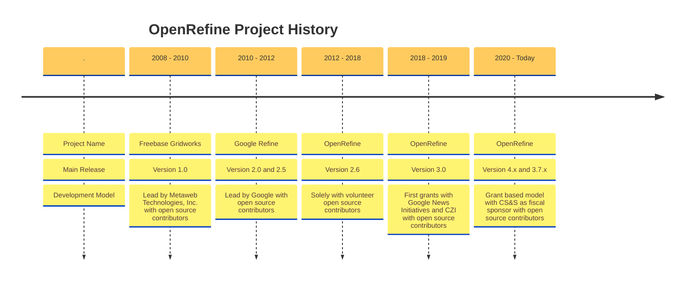

## Freebase Gridworks

The history of OpenRefine dates back to May 2010, when Metaweb Technologies, Inc. initiated the development of an open-source data cleansing tool named Freebase Gridworks. Freebase Gridworks, conceived by David Huynh, simplified data cleaning and transformation data to import into Freebase, a large collaborative knowledge base built by Metaweb. Freebase Gridworks offered a user interface for editing and reconciling large datasets.

## Google Refine

In July 2010, Google acquired Metaweb Technologies and with it, Freebase Gridworks. Following this acquisition, the tool was renamed "Google Refine". Under Google’s stewardship, Google Refine 2.0 was released, featuring enhanced data cleaning capabilities. This version established the tool's reputation for handling various data-related tasks, such as cleaning messy data, transforming data formats, and extending data sets with web services.

## OpenRefine

In 2012, Google made the decision to discontinue the development of Google Refine. Existing project contributors took over the project and renamed it "OpenRefine". The project was then moved to Github. The following year saw OpenRefine gaining a diverse user base, including scientists and researchers, journalists, Linked Open Data practitioners, librarians, and cultural heritage specialists.

## OpenRefine joins Code for Science and Society

In 2017, OpenRefine began integrating with Wikidata by creating a reconciliation endpoint and a process to publish data to the Wikimedia project. The project's logo was updated to the current one in 2018, and Google News Initiative donated $100,000 to support its further development. 

OpenRefine adopted a grant-based sustainability model the following year when it received USD 200,000 through the Chan-Zuckerberg Initiative EOSS-1. In 2020, OpenRefine became a fiscally sponsored project of Code for Science and Society, a 501(c)(3) charitable organization in the USA, and an Advisory Committee was formed. During that time, OpenRefine experienced tremendous growth by doubling the number of active contributors, increasing the number of translated languages, and seeing more users rely on it.

Since then, OpenRefine has secured recurring funding from CZI, the Wikimedia Foundation, and NFDI to ensure the project's long-term viability. This funding has helped the project rely on a combination of volunteers and contractors for its development. 

