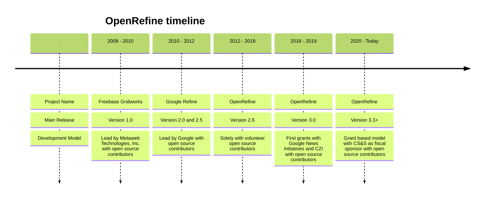

# OpenRefine History 

Over the last ten years, OpenRefine has undergone significant transformations, including changes in its name and development model. It has transitioned from an enterprise-led open source model to a community-based open source model, with later support from occasional grants.

## 2008 - 2010: Freebase Gridworks

The history of OpenRefine dates back to May 2010, when Metaweb Technologies, Inc. initiated the development of an open-source data cleansing tool named Freebase Gridworks. Freebase Gridworks, conceived by David Huynh, simplified data cleaning and transformation data to import into Freebase, a large collaborative knowledge base built by Metaweb. Freebase Gridworks offered a user interface for editing and reconciling large datasets.

## 2010 - 2012: Google Refine

In July 2010, Google acquired Metaweb Technologies and with it, Freebase Gridworks. Following this acquisition, the tool was renamed "Google Refine". Under Google's stewardship, Google Refine 2.0 was released, featuring enhanced data cleaning capabilities. This version established the tool's reputation for handling various data-related tasks, such as cleaning messy data, transforming data formats, and extending data sets with web services.

## 2012 - 2019: OpenRefine

In 2012, Google transferred leadership of the project to the open source community, who renamed it "OpenRefine" and moved it to GitHub. The following years saw OpenRefine continuing to gain a diverse user base, including scientists and researchers, journalists, semantic web practitioners, librarians, and cultural heritage specialists.

In 2017, OpenRefine began integrating with Wikidata thanks to the availability of a reconciliation endpoint and a process to publish data to the Wikimedia project.

In December 2018, Google News Initiative donated $100,000 to support OpenRefine development. The same year the project's logo was updated.

## 2019 - today: OpenRefine, part of Code for Science & Society

In the following years, OpenRefine confirmed its grant-based sustainability model by receiving recurring funding from the Chang Zuckerberg Initiative, the Wikimedia Foundation, and NFDI. To help manage funds, OpenRefine became a fiscally sponsored project of Code for Science and Society (CS&S), a 501(c)(3) charitable organization in the USA, in 2020. 

During that time, OpenRefine experienced tremendous growth by doubling the number of active contributors (both paid and volunteers), increasing the number of translated languages, adding native integration with Wikimedia Commons and Wikibase, and seeing more users rely on it. The project also became more organized with the creation of an Advisory Committee and participation in internship programs like Google Summer of Code and Outreachy. 
