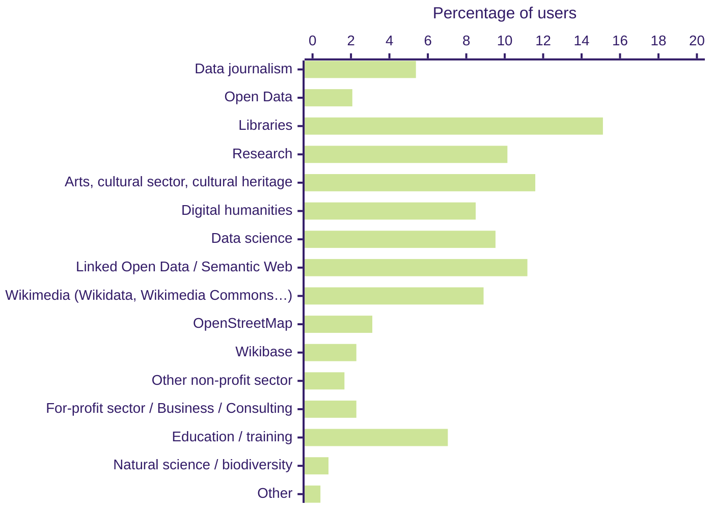
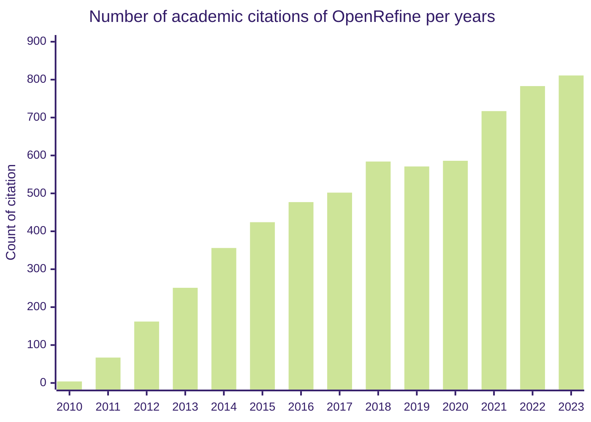

# OpenRefine Usage 

OpenRefine is a free, open source power tool for working with messy data and improving it: cleaning it, transforming it from one format into another, and extending it with web services and external data. Requiring no knowledge of a programming or query language, it lets users find and fix inconsistencies interactively, match their data to external databases, pull additional data from these, and many other useful operations. The resulting workflows can be extracted and applied to other
datasets

On average, OpenRefine is downloaded on average 15,500 times per month and receives over 800 academic citations in 2023.

## Our Users Community

OpenRefine has been embraced by a wide range of communities across various fields. OpenRefine's flexibility and user-friendly interface make it applicable to a wide range of use cases and industries, for example:
1. **Journalists and Media Professionals** use OpenRefine to clean and prepare data for investigative reporting, analysis, and visualization in news stories.
2. **GLAM (Galleries, Libraries, Archives, and Museums)** utilizes OpenRefine to clean and enhance catalog records related to artworks and cultural heritage artifacts.
3. **Wikipedians and Wikimedia Contributors**: OpenRefine is a popular tool within the Wikipedia community, enabling users to manage and improve structured data on Wikimedia projects like Wikidata and Wiki Commons.
4. **Scientists and Researchers** across various scientific disciplines, including social, natural, and health sciences, use OpenRefine to clean, transform, and organize research data.
5. **Data Analysts and Scientists** leverage OpenRefine to preprocess and clean data, ensuring high data quality before analysis.
6. **Educators and Trainers**: OpenRefine is integrated into educational curricula and workshops, allowing educators to teach students data wrangling and cleaning skills effectively.

The following graphic represent the distribution of the communities our users most identify with from our [2022](/blog/2022/06/28/2022-survey-results) user survey (note that one user may identify itself with multiple communities).



### Downloads

As of March 20, 2024, Github provide us with the following download count per release: 
 
| Release   | Release Date | Download |
| :-------- | :----------- | -------------: |
| 3.8-beta1 | 2024-02-21    |         2,829 |
| 3.7.9     | 2024-02-10    |        21,758 |
| 3.7.7     | 2023-11-29    |        34,715 |
| 3.7.6     | 2023-10-09    |        32,908 |
| 3.7.5     | 2023-09-11    |        17,934 |
| 3.7.4     | 2023-07-17    |        25,012 |
| 3.7.3     | 2023-06-26    |         9,940 |
| 3.7.2     | 2023-04-05    |        41,621 |
| 3.7.1     | 2023-03-10    |        15,576 |
| 3.7.0     | 2023-02-15    |        14,573 |
| 3.7-beta5 | 2023-01-27    |         1,223 |
| 3.7-beta2 | 2022-12-12    |         2,372 |
| 3.6-beta2 | 2022-06-06    |           997 |
| 3.5.2     | 2022-01-26    |        73,861 |
| 4.0-alpha1| 2021-12-30    |           286 |
| 3.5.1     | 2021-12-19    |        11,676 |
| 3.5.0     | 2021-11-07    |        18,143 |
| 3.5-beta2 | 2021-10-25    |           738 |
| 3.5-beta1 | 2021-05-29    |         6,218 |
| 3.4.1     | 2020-09-24    |      149,121 |
| 3.4       | 2020-09-06    |         9,390 |

OpenRefine does not track local usage of the software.

### Academic Citations 
As a central tool in research workflow, 
The count of publication is based on the number of citation for the following Google Scholar search for each tearm with a custom date range:
* [Google Refine](https://scholar.google.ca/scholar?hl=en&as_sdt=0%2C5&as_ylo=2023&as_yhi=2023&q=%22Google+Refine%22+-openrefine&btnG=)
* [Open Refine](https://scholar.google.ca/scholar?hl=en&as_sdt=0%2C5&as_ylo=2023&as_yhi=2023&q=%22Open+Refine%22+-openrefine&btnG=)
* [OpenRefine](https://scholar.google.ca/scholar?hl=en&as_sdt=0%2C5&as_ylo=2023&as_yhi=2023&q=%22OpenRefine%22&btnG=)




## Forum Statistic 
As of March 20, 2024, over the last 12 months
* 244 new users signed up on our forum for a total of 470 users. 
* 324 topics were created for a total of 1,700 messages.

## Contribution Statistics

The following statitics track only activity on our GitHub main repository, which include code, design and translation contribution. Documentation is available on a separate repository. 

As of March 20th, 2024, over the last 12 months we have: 
* 43 active github contributors (including dependabot and weblate);
* [226 issues created](https://github.com/OpenRefine/OpenRefine/issues?q=is%3Aissue+created%3A%3E2023-03-13+);
* [278 PR created](https://github.com/OpenRefine/OpenRefine/pulls?q=is%3Apr+created%3A%3E2023-03-13) (excluding PR created by [dependabot](https://github.com/OpenRefine/OpenRefine/pulls?q=is%3Apr+created%3A%3E2023-03-13+dependabot)) and [263 merged](https://github.com/OpenRefine/OpenRefine/pulls?q=is%3Amerged+created%3A%3E2023-03-13+);


```mermaid 
%%{init: {'theme':'forest'}}%%
xychart-beta 
    x-axis   2010 --> 2023
    y-axis "Number of GitHub contributors per month" 0 --> 30 
    line [1,2,3,5,4,3,2,2,4,5,4,4,2,3,0,2,3,2,2,3,2,3,3,2,2,1,2,1,1,1,2,2,2,1,3,4,2,1,1,4,2,3,1,2,0,2,2,3,0,2,5,4,3,2,6,4,0,4,1,8,3,5,0,1,0,0,0,1,1,0,1,2,1,2,0,0,5,5,2,4,4,6,8,3,12,9,12,12,17,13,14,14,6,8,8,9,10,16,12,8,4,10,7,4,4,9,6,8,11,7,4,13,11,27,25,15,22,21,18,18,16,19,7,19,23,14,22,16,12,7,9,12,15,18,12,18,17,19,21,11,14,17,13,7,14,14,10,9,10,13,13,12,10,8,7,9,9,8,6,12]
    ```
You can also review the [Github pulse](https://github.com/OpenRefine/OpenRefine/pulse) and [Github traffic](https://github.com/OpenRefine/OpenRefine/graphs/traffic) pages for real time insights on the activities on our main repository. 
