# OpenRefine Usage 

OpenRefine is a free, open source power tool for working with messy data and improving it: cleaning it, transforming it from one format into another, and extending it with web services and external data. Requiring no knowledge of a programming or query language, it lets users find and fix inconsistencies interactively, match their data to external databases, pull additional data from these, and perform many other useful operations. The resulting workflows can be extracted and applied to other datasets.

**OpenRefine is downloaded on average 15,500 times per month** and received over 800 academic citations in 2023.

## Our Users Community

OpenRefine is used by many communities and industries due to its user-friendly interface and flexibility.
1. **Journalists and Media Professionals** use OpenRefine to clean and prepare data for investigative reporting, analysis, and visualization in news stories.
2. **GLAM (Galleries, Libraries, Archives, and Museums)** utilizes OpenRefine to clean and enhance catalog records related to artworks and cultural heritage artifacts.
3. **Wikipedians and Wikimedia Contributors**: OpenRefine is a popular tool within the Wikipedia community, enabling users to manage and improve structured data on Wikimedia projects like Wikidata and Wiki Commons.
4. **Scientists and Researchers** across various scientific disciplines, including social, natural, and health sciences, use OpenRefine to clean, transform, and organize research data.
5. **Data Analysts and Scientists** leverage OpenRefine to preprocess and clean data, ensuring high data quality before analysis.
6. **Educators and Trainers**: OpenRefine is integrated into educational curricula and workshops, allowing educators to teach students data wrangling and cleaning skills effectively.

The graphic below shows which communities our users identified with most, based on our [2024](/blog/2024/12/20/2024-survey-results) user survey. Please note that each user may identify with multiple communities.

```mermaid
%%{init: {'theme':'forest'}}%%
xychart-beta horizontal
    x-axis  
    ["Data journalism", "Libraries", "Research", "Arts, cultural sector, cultural heritage", "Digital humanities", "Data science", "Linked Open Data / Semantic Web", "Wikimedia (Wikidata, Wikimedia Commons…)", "OpenStreetMap", "Wikibase", "Other non-profit sector", "For-profit sector / Business / Consulting", "Education / training"]
    y-axis "Percentage of users" 0 --> 40
    bar "Percentage" 
      [6.64, 38.50, 34.07, 22.57, 15.49, 25.66, 25.66, 15.04, 8.85, 12.39, 7.08, 6.64, 17.70]
```

## Academic Citations 
OpenRefine is used by many academics in their research and cited in their publications. OpenRefine is also available on Zenodo with the [DOI-10.5281](https://zenodo.org/records/10689569) if you intend to cite it. The table below track the number of citation per year based by searching the following terms on Google Scholar:
* [Google Refine](https://scholar.google.ca/scholar?hl=en&as_sdt=0%2C5&as_ylo=2023&as_yhi=2023&q=%22Google+Refine%22+-openrefine&btnG=)
* [Open Refine](https://scholar.google.ca/scholar?hl=en&as_sdt=0%2C5&as_ylo=2023&as_yhi=2023&q=%22Open+Refine%22+-openrefine&btnG=)
* [OpenRefine](https://scholar.google.ca/scholar?hl=en&as_sdt=0%2C5&as_ylo=2023&as_yhi=2023&q=%22OpenRefine%22&btnG=)

(*) 2025 data are up to July 15, 2024.

## Forum Statistics 

In November 2022, we moved from email lists hosted by Google Groups to a Discourse forum. 

As of July 15th, 2025, over the last 12 months:
* 265 new users signed up[^1] on our forum for a total of 720 users[^2].
* 278 topics[^3] were created for a total of 1,522 messages[^4].

## Contribution Statistics

The statistics below only track activity on our primary GitHub repository, which includes code, design, and translation contributions. Our documentation is available in a separate repository.

As of July 15th, 2025, over the last 12 months we had:
* 22 active GitHub contributors;
* 163 issues [created](https://github.com/OpenRefine/OpenRefine/issues?q=is%3Aissue%20created%3A2024-07-15..2025-07-15) and 157 [closed](https://github.com/OpenRefine/OpenRefine/issues?q=is%3Aissue%20closed%3A2024-07-15..2025-07-15);
* [212 PRs merged](https://github.com/OpenRefine/OpenRefine/pulls?q=is%3Amerged+created%3A2024-07-15..2025-07-15+-author%3Aapp%2Fdependabot) (excluding those created by dependabot)

The following graphic represents the average number of active contributors to the main repository each year[^5]. You can also review the [Github pulse](https://github.com/OpenRefine/OpenRefine/pulse) and [Github traffic](https://github.com/OpenRefine/OpenRefine/graphs/traffic) pages for real time insights on the activities on our main repository.

(*) 2025 data are up to July 15th, 2025.
[^1]: From [this page](https://forum.openrefine.org/admin/reports/signups?end_date=2024-12-03&mode=table&start_date=2023-12-03) with discourse admin priviledge
[^2]: See the count of users on [this page](https://forum.openrefine.org/u?order=likes_received&period=all)
[^3]: From [this page](https://forum.openrefine.org/admin/reports/topics?end_date=2024-12-03&mode=table&start_date=2023-12-03) with discourse admin priviledge
[^4]: From [this page](https://forum.openrefine.org/admin/reports/posts?end_date=2024-12-03&mode=table&start_date=2023-12-03) with discourse admin priviledge
[^5]: We are counting the number of contributor using the following command `git log --all --pretty="%an" | sort | uniq | wc -l`
